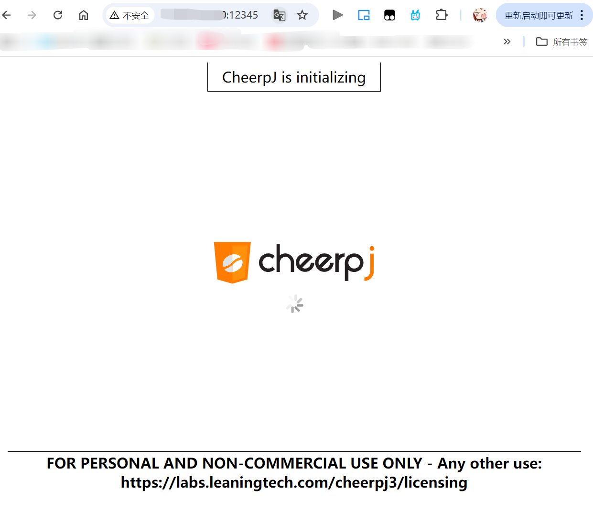

#  ✈️WebServer-PlaneWar

> 一个基于 C++17 重构的高性能 Web 服务器，并在浏览器中运行经典“飞机大战”游戏。

## 🌟 项目简介 (Introduction)

本项目是一个基于 **C++17** 从零手写的高性能 HTTP Web 服务器。

在实现基础的静态资源请求处理、高并发连接管理之上，引入了 **Cheerpj** 运行环境。 

服务器基于该组件将原生基于 Java 开发的经典“飞机大战”（Plane War）小游戏转化为 Web 应用，输入服务器地址后即可在浏览器中畅玩。

## 🚀 技术亮点 (Highlights)

* 封装了**文件描述符（channel类）**，**Epoll 事件（Epoller类）**，**HTTP 连接（HttpConn类）** 等核心组件。
* 利用 **I/O 多路复用技术（Epoll）** 和 **线程池** 实现高效的 **事件驱动（Reactor）模型**。
* 基于 **有限状态机 (FSM)** 实现 HTTP 请求解析器。
* 实现了支持多线程并发写入的 **异步日志系统**。基于阻塞队列将前端写日志的动作与后端磁盘 I/O 分离。
* 基于 **小根堆** 实现的定时器，关闭超时的非活动连接。
* 支持 **206 Partial Content** 响应，满足断点续传需求。
* 引入 **Cheerpj** 将 Java 游戏转化为 Web 应用，完美运行经典“飞机大战”游戏。
* 基于 AWT 和 Swing 组件实现游戏菜单，游戏界面和控制界面。

## 🧩 C++17 特性应用 (C++17 Features)

* 基于 **string_view** 和 **滑动窗口** 封装标准库容器，实现自动增长的缓冲区。
* 基于 **filesystem** 实现文件系统操作，保证页面安全性。
* 基于 **function** 实现回调函数，简化事件处理逻辑。
* 基于 **optional** 实现 HTTP 请求解析器，简化状态管理。
* 基于 **shared_ptr** 和 **unique_ptr** 简化内存管理，避免文件描述符泄漏。
* 实现 MPMC（多生产者多消费者）线程安全 **无锁队列**，支持线程池和异步日志系统。


## ⚙️ 环境要求 (Requirements)

* C++17 以上
* CMake 3.10 以上
* Linux 操作系统

## 🛠️ 构建与运行 (Build & Run)

1. 克隆仓库并进入项目目录：

   ```bash
   git clone
   cd WebServer-PlaneWar  
   ```
   
2. 使用 CMake 构建项目：

   ```bash
    mkdir build
    cd build
    cmake ..
    make
    ```
3. 运行服务器：
    ```bash
    ./WebServer
    ```
4. 在浏览器中访问 `http://localhost:12345` 运行“飞机大战”游戏。 

## 🎮 游戏截图 (Screenshots)

首次进入网页时会自动下载Cheerpj运行环境，可能需要等待几秒钟加载完成。



游戏开始界面：


游戏运行时界面：


角色生命归零，游戏结束：


## 📁 项目结构 (Project Structure)

```
.
│  CMakeLists.txt
│  readme.md
│
├─readme_assest
│      gameover.png
│      gameplay.gif
│      gamestart.png
│      loading.png
│
├─resources
│      index.html
│      planewar.jar
│
├─src
│  │  CMakeLists.txt
│  │  main.cpp
│  │
│  ├─buffer
│  │      buffer.cpp
│  │      buffer.h
│  │
│  ├─http
│  │      http_conn.cpp
│  │      http_conn.h
│  │      http_request.cpp
│  │      http_request.h
│  │      http_response.cpp
│  │      http_response.h
│  │
│  ├─log
│  │      logger.cpp
│  │      logger.h
│  │
│  ├─planewar
│  │  │  Sansation.ttf
│  │  │
│  │  ├─images
│  │  │  ├─object
│  │  │  │      boom.png
│  │  │  │      boom_smaller.png
│  │  │  │      bullet.png
│  │  │  │      enemyBlack.png
│  │  │  │      enemyBlue.png
│  │  │  │      enemyRed.png
│  │  │  │      enemyWhite.png
│  │  │  │      health.png
│  │  │  │      player.png
│  │  │  │      spell.png
│  │  │  │
│  │  │  └─ui
│  │  │          gameover.png
│  │  │          icon.png
│  │  │          pause.png
│  │  │          playBg.png
│  │  │          start.png
│  │  │          state.png
│  │  │
│  │  └─src
│  │      ├─lib
│  │      │      lombok-1.18.20.jar
│  │      │
│  │      ├─META-INF
│  │      │      MANIFEST.MF
│  │      │
│  │      ├─object
│  │      │      Boom.java
│  │      │      Bullet.java
│  │      │      Enemy.java
│  │      │      EnemyBlack.java
│  │      │      EnemyBlue.java
│  │      │      EnemyRed.java
│  │      │      EnemyWhite.java
│  │      │      FlyingObject.java
│  │      │      Player.java
│  │      │
│  │      └─ui
│  │              Game.java
│  │
│  ├─pool
│  │      threadpool.h
│  │
│  ├─server
│  │      channel.h
│  │      epoller.cpp
│  │      epoller.h
│  │      server.cpp
│  │      server.h
│  │
│  ├─timer
│  │      heap_timer.cpp
│  │      heap_timer.h
│  │
│  └─util
│          get_root.h
│          lock_free_queue.hpp
│
└─test
        CMakeLists.txt
        server_test.cpp
```

